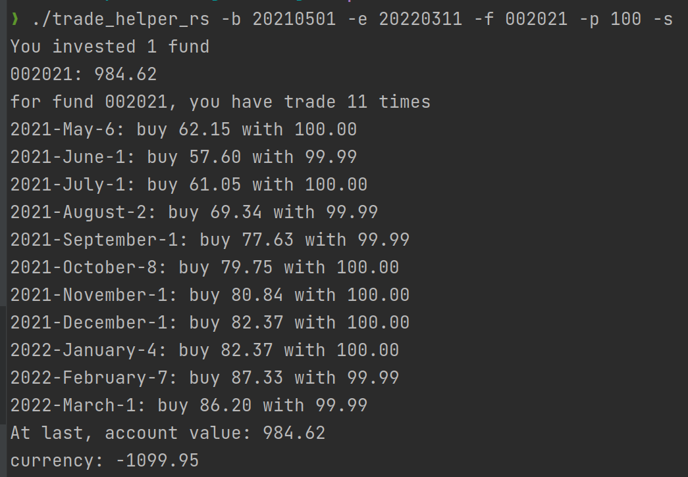
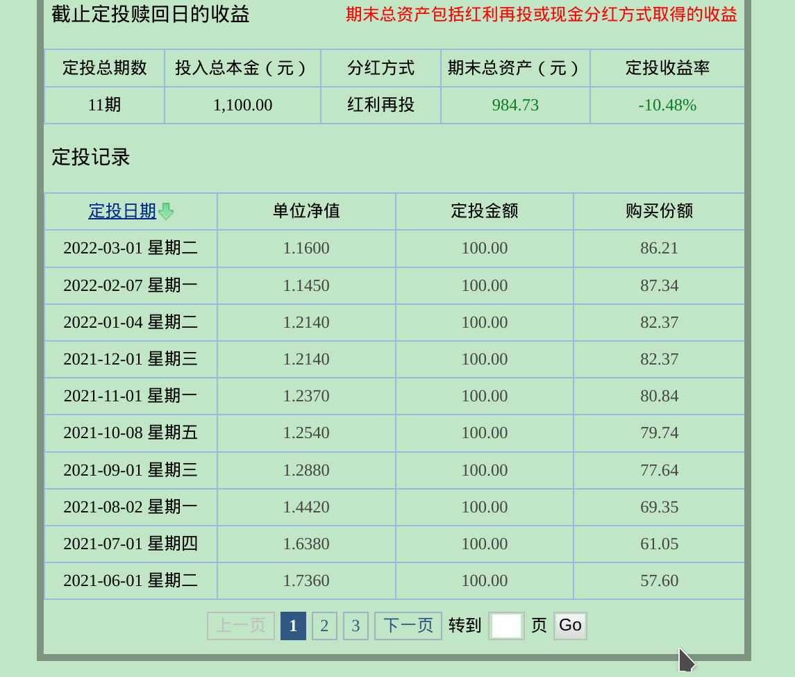
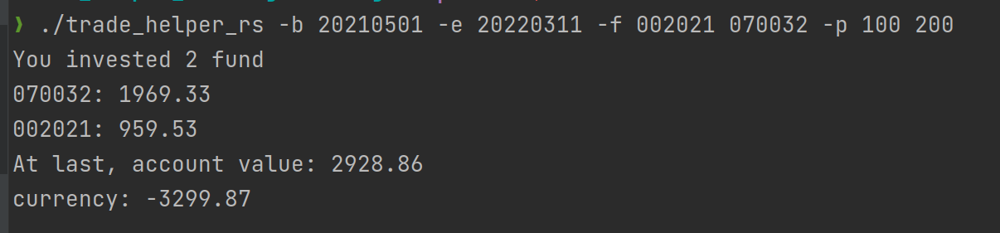

# A fund/stock backtester/live framework in Rust[](https://www.rust-lang.org/)


[](https://codecov.io/gh/q9good/trade_helper_rs)
[](https://github.com/q9good/trade_helper_rs/releases/latest)


# Usage/使用说明
----
 trade_helper_rs [OPTIONS] --begin <BEGIN> --end <END> --FUND LIST <FUND LIST>... --BUDGET PLAN FOR FUNDS <BUDGET PLAN FOR FUNDS>...
````
  OPTIONS:
    -b, --begin <BEGIN>
            交易开始日，格式yyyymmdd

    -d, --day <DAY>
            定投周期，每月第几日购买，默认为第一天，非交易日顺延

    -e, --end <END>
            交易结束日，格式yyyymmdd

    -f, --FUND LIST <FUND LIST>...
            定投基金代码，支持多只基金，以空格隔开

    -h, --help
            打印帮助信息

    -p, --BUDGET PLAN FOR FUNDS <BUDGET PLAN FOR FUNDS>...
            每期定投金额，需与基金数目保持一致，以空格隔开

    -s
            是否显示详细交易过程

    -V, --version
            版本信息
````
# Example/示例
----
1. 单只基金
2021年5月1日至2022年3月11日期间，每月1号用100元买入基金002021华夏回报二号混合。
> ./trade_helper_rs -b 20210501 -e 20220311 -f 002021 -p 100 -s

  程序运行结果如下图所示：

  网站结果如下图所示：

2. 多只基金
  同样地，2021年5月1日至2022年3月11日期间，每月1号分别用100元和200元买入基金002021华夏回报二号混合和070032嘉实优化红利混合
> ./trade_helper_rs -b 20210501 -e 20220311 -f 002021 070032 -p 100 200



# Roadmap/路线图
----
## FUND/基金
1. ~~获取基金历史数据~~
2. ~~同时获取多只基金数据~~
3. 获取实时数据

## STOCK/股票
1. 获取股票历史数据
2. 同时获取多只股票数据
3. 获取实时数据

## COMMON/公共部分
1. ~~基金/股票账户的统一操作~~
2. 支持不同策略的运行
3. 底层查询类功能提供python接口
4. 网页前端展示运行结果 
